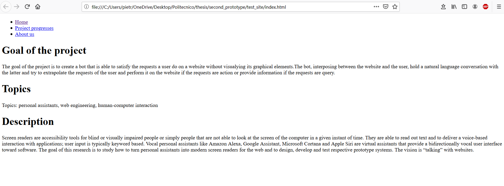
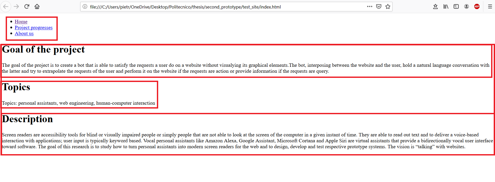

# ConversationalWeb
The purpose of this repo is to define the annotation format to use in html files in order to generating conversational agents (chatbots) out of websites. The scope of the annotation is to add information to the elements in the page. The information we provide with the annotation is necessary for the system to works correctly.

## Scenario
Consider the following web site: 

<figure><figcaption>Fig 1</figcaption></figure>
In order to create a conversational agent our system have to extrapolate web element in the site and give some semantic meaning to them:

<figure><figcaption>Fig2</figcaption></figure>

In a first implementation, our system is not able to detect the relevant elements of a page, so it needs the help of the web developer. The developer has to take in mind that there are two layer:

1. App specific layer (TBD the name)
2. Element specific layer

First the developer has to decide what are the app specific element

In the Fig 2 I selected 5 app specific elements:

1. The menu
2. The _Goal of the project_ paragraph
3. The _Topic_ paragraph
4. The _Description_ paragraph
5. The container of 2, 3 and 4

There are no rule to define which are the app specific elements, it depends on the common sense of the web dev. A way that can help to identify them could be  ask yourself the following question:

> What a user can do in this page?

In the example the answer is:

> The user can use the menu (1), he can read some information about the project (5) in particular the goal (2), the topics (3) and the description (4)

**NB**: This isn't the unique answer

Another good way is to group elements. For example _goal_, _topics_ and _description_ are all _information_ about the project, so I group them under the element 5.

Once the _app specific_ element are defined ...to be continued...

## Annotation
As it is explained in the scenario, we can distinguish two type of annotation:
* App specific
* Element specific

### App specific annotation
The app specific annotation add semantic information to the web pages and when we have to add them, we have to make a question to ourself: What a user can do in this page? or Which services provide the page or the specific part of the page?
This information are provided with three attributes inside a html element:
1. bot-intent
2. intent-desc
3. bot-type

#### bot-intent
Given an html elements we can use it for different reason, for example if we have a table or a paragrah we can use it to acquire information, if we have a form we can use it to perform an action (i.e. login, buy ticket, etc) etc. The **bot-intent** annotation needs to provide this kind of information.
Here an example:
Consider we have a web page regarding a project and inside it we have a _div_ element that contain the information about the gol of the project. The proper way to add this information is to add the _bot_intent_ attribute in the _div_ element and write that it contains the information about the gol of the project:

<pre><code class="language-html">
&lt;div bot-intent="project_info_gol"&gt; 
    &lt;h1&gt;Goal of the project&lt;/h1&gt;
    &lt;p&gt;
        Some text ...
    &lt;/p&gt;
&lt;/div&gt;
</code></pre>

#### intent-desc
The _intent-desc_ attribute provide the description of the intent that is specified in the _bot-intent_ element. Any time there is _bot-intent_ attribute, also the _intent-desc_ must be present. The value of this attribute have to answer the question _"What can you do?"_ considering that the question is made by the user of the site and the response came from the bot. Here an example:

<pre><code class="language-html">
&lt;div bot-intent="project_info_gol" intent-desc="Tell you the gol of the project"&gt; 
    &lt;h1&gt;Goal of the project&lt;/h1&gt;
    &lt;p&gt;
        Some text ...
    &lt;/p&gt;
&lt;/div&gt;
</code></pre>

#### bot-type
This attribute specifies the type of the element; the type can be:
* **text**: if contains only text
* **list**: if contains a list of object
* **form**: if contains a form
* **app**: if inside the element there are one or more _bot-intent_ elements
* _to be define..._

Example:
<pre><code class="language-html">
&lt;div bot-intent="project_info_gol" 
    bot-type="text"
    intent-desc="Tell you the gol of the project"&gt; 
    &lt;h1&gt;Goal of the project&lt;/h1&gt;
    &lt;p&gt;
        Some text ...
    &lt;/p&gt;
&lt;/div&gt;
</code></pre>

### Element Specific
When we are inside an html element that has an attribute _bot-intent_, we have to provide some  information to the sub elements.
We can annotate them with the attribute **bot-element**. 
NB: the _bot-element_ attribute is not mandatory for each sub element

#### Text Element
Consider an element with an attribute _bot-type_ which value is **text**, then the value of _bot-element_ attribute in its sub element can be :
* _title_: if the text is a title
* _text_: if the text is simple text

Example: 
<pre><code class="language-html">
&lt;div bot-intent="project_info_gol" 
    bot-type="text"
    intent-desc="Tell you the gol of the project"&gt; 
    &lt;h1 bot-element="title"&gt;Goal of the project&lt;/h1&gt;
    &lt;p bot-element="text"&gt;
        Some text ...
    &lt;/p&gt;
&lt;/div&gt;
</code></pre>