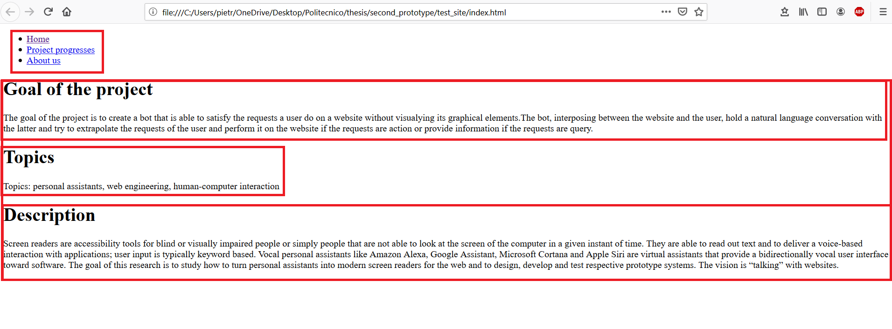
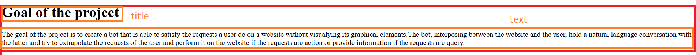

# ConversationalWeb
The purpose of this repo is to define the annotation format to use in html files in order to generating conversational agents (chatbots) out of websites. The scope of the annotation is to add information to the elements in the page. The information we provide with the annotation is necessary for the system to works correctly.

## Scenario
Consider the following web page: 

<figure><figcaption>Fig 1</figcaption></figure>
In order to create a conversational agent our system have to extrapolate web element in the site and give some semantic meaning to them:

<figure><figcaption>Fig2</figcaption></figure>
In a first implementation, our system is not able to detect the relevant elements of a page, so it needs the help of the web developer. The developer has to take in mind that there are two layers:

1. App specific layer (TBD the name)
2. Element specific layer

First the developer has to decide what are the app specific elements (the red blocks).

In the Fig 2 I selected 5 app specific elements:

1. The _menu_
2. The _Goal of the project_ paragraph
3. The _Topic_ paragraph
4. The _Description_ paragraph
5. The container of 2, 3 and 4

There are no rule to define which are the app specific elements, it depends on the common sense of the web dev. A way that can help to identify them could be to ask yourself the following question:

> What a user can do in this page?

In the example the answer is:

> The user can use the menu (1), he can read some information about the project (5) in particular the goal (2), the topics (3) and the description (4)

**NB**: This isn't the unique answer.

Another good way is to group elements according to their context. For example _goal_, _topics_ and _description_ are all _information_ about the project, so I group them under the element number 5.

Once the _app specific_ element are defined, the web dev can provide other information regarding the elements inside each block:

<figure><figcaption>Fig 3</figcaption></figure>
In Fig 3, for example the developer can say that there is a title and some text

The web developer also has to annotate the **external link** (only the relevant ones) in order to permits the navigation among pages.

In the next section the annotation format will be explained.

## Annotation
As it is explained in the scenario, we can distinguish three type of annotation:

* App specific
* Element specific
* Navigation

### App specific annotation
The app specific annotation need to define the app specific block described before. In order to define them the web developer has to specify three attributes:
1. bot-intent
2. intent-desc
3. bot-type

#### bot-intent
Given an app element we can use it for different reason, for example if we have a table or a paragraph we can use it to acquire information, if we have a form we can use it to perform an action (i.e. login, buy ticket, etc) etc. The **bot-intent** annotation needs to provide this kind of information.
Here an example:
Consider we have a web page regarding a project (as in the example) and inside it we have a _div_ element that contain the information about the goal of the project (block number 2). The proper way to add this information is to add the _bot-intent_ attribute in the _div_ element and write that it contains the information about the gol of the project:

<pre><code class="language-html">
&lt;div bot-intent="project_info_gol"&gt; 
    &lt;h1&gt;Goal of the project&lt;/h1&gt;
    &lt;p&gt;
        Some text ...
    &lt;/p&gt;
&lt;/div&gt;
</code></pre>

#### intent-desc
The _intent-desc_ attribute provide the description of the intent that is specified in the _bot-intent_ element. Any time there is _bot-intent_ attribute, also the _intent-desc_ must be present. The value of this attribute has to answer the question _"What can you do?"_ considering that the question is made by the user of the site and the response came from the bot. Here an example:

<pre><code class="language-html">
&lt;div bot-intent="project_info_gol" intent-desc="Tell you the gol of the project"&gt; 
    &lt;h1&gt;Goal of the project&lt;/h1&gt;
    &lt;p&gt;
        Some text ...
    &lt;/p&gt;
&lt;/div&gt;
</code></pre>

#### bot-type
This attribute specifies the type of the element; the type can be:
* **text**: if contains only text
* **list**: if contains a list of object
* **form**: if contains a form
* **table**: if contains a table
* _to be define..._

**NB**: If there is a _bot-intent_ attribute but there isn't the _bot-type_ one, the system consider that intent as a container of sub intents.

Example:
<pre><code class="language-html">
&lt;div bot-intent="project_info_gol" 
    bot-type="text"
    intent-desc="Tell you the gol of the project"&gt; 
    &lt;h1&gt;Goal of the project&lt;/h1&gt;
    &lt;p&gt;
        Some text ...
    &lt;/p&gt;
&lt;/div&gt;
</code></pre>

### Element Specific
When we are inside an html element that has an attribute _bot-intent_, we have to provide some  information about the sub elements.
We can annotate them with the attribute **bot-attribute**. 
NB: the _bot-element_ attribute is not mandatory for each sub element

#### Text Element
Consider an element with an attribute _bot-type_ which value is **text**, then the value of _bot-attribute_ attribute in its sub element can be :
* _title_: if the text is a title
* _paragraph_: if the text is simple text
* _list_: if there is a list of text

Example: 
<pre><code class="language-html">
&lt;div bot-intent="project_info_gol" 
    bot-type="text"
    intent-desc="Tell you the gol of the project"&gt; 
    &lt;h1 bot-attribute="title"&gt;Goal of the project&lt;/h1&gt;
    &lt;p bot-attribute="paragraph"&gt;
        Some text ...
    &lt;/p&gt;
&lt;/div&gt;
</code></pre>

### Navigation

The goal of the system is to take a conversation on all the web site. Web sites are composed by multiple web pages linked together. In this section will be explained how annotate the page in order to link it with other web pages.

First we consider _internal link_, so an hyperlink on a web page to another web page or resource on the same website. Consider two pages:

<figure><figcaption>Fig 4</figcaption></figure>
It could be two type of link:

* A link that goes to another page: **page link **(name?)
* A link that goes to an intent (anchor) of another page: **anchor link** (name?)

#### Page link

A page link is a link that is connected with another page of the same website. 

<figure><figcaption>Fig 5</figcaption></figure>
The annotation for this type of link is simple: the developer has to add **bot-link** attribute in the right position of the html. Consider an example in which the user is in _page1.html_ and there is a link connecting page1 with page2. The following code is an example of annotation of the previous scenario:

<pre><code class="language-html">
&lt;ul&gt; 
    &lt;li bot-link="page2.html"&gt;Goal of the project&lt;/h1&gt;
&lt;/ul&gt;
</code></pre>

#### Anchor link

An anchor link is connected to an intent of another page. 

<figure><figcaption>Fig 6</figcaption></figure>

The annotation here is similar to the html anchor.  If the web developer want to make an intent an anchor has to annotate it with the tag _&lt;a&gt;_:

<pre><code class="language-html">
&lt;a bot-intent="intent4" 
    bot-type="text"
    intent-desc="Tell you the gol of the project"&gt;
    &lt;/div&gt;
        &lt;h1 bot-attribute="title"&gt;Goal of the project&lt;/h1&gt;
        &lt;p bot-attribute="paragraph"&gt;
            Some text ...
        &lt;/p&gt;
	&lt;/div&gt;    
&lt;/a&gt;
</code></pre>

Once the intent is marked as an anchor, the _anchor link_ can be done; as in the _page link_ case the **bot-link** attribute must be added in the correct position of the html file and the value is the name of the page of the anchor intent followed by **#** character and the name of the intent. 

Example:

<pre><code class="language-html">
&lt;ul&gt; 
    &lt;li bot-link="page2.html#intent4"&gt;Goal of the project&lt;/h1&gt;
&lt;/ul&gt;
</code></pre>